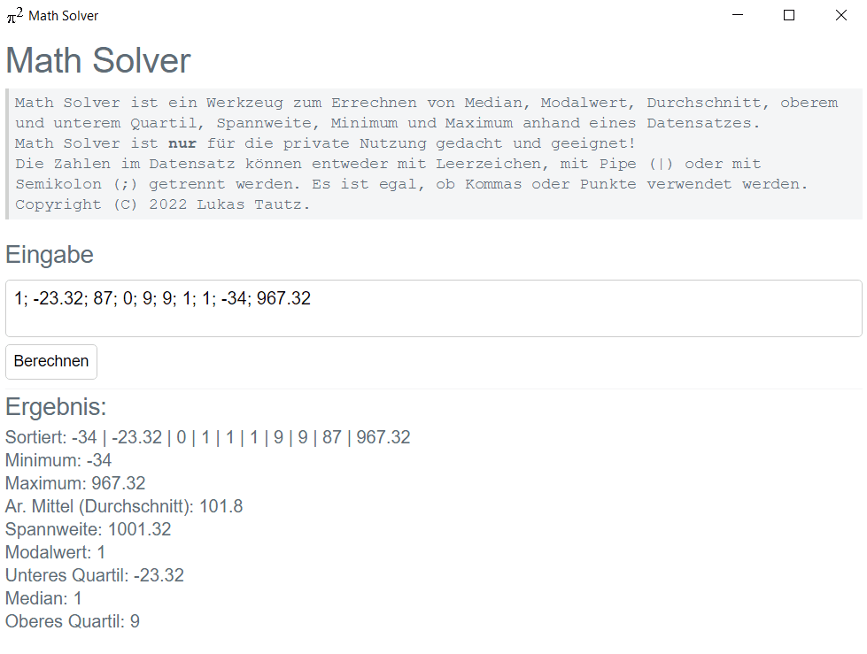

# Math Solver

Math Solver ist ein Werkzeug zum Errechnen von Median, Modalwert, Durchschnitt, oberem und unterem Quartil, Spannweite, Minimum und Maximum anhand eines Datensatzes. 
Math Solver ist nur für die private Nutzung gedacht und geeignet! 
Die Zahlen im Datensatz können entweder mit Leerzeichen, mit Pipe (|) oder mit Semikolon (;) getrennt werden. Es ist egal, ob Kommas oder Punkte verwendet werden. 
Copyright (C) 2022 Lukas Tautz. 

Aktuell gibt es nur eine Windows-Version von Math Solver. Da Math Solver auf PHP basiert, könnte ich auch noch eine Linux-Version entwickeln, wenn Bedarf besteht. 

## Download
Hier können Sie die neueste Windows-Stable-Version herunterladen: [mathsolver.exe](https://github.com/lukastautz/mathsolver/releases/download/mathsolver/mathsolver.exe). 
Hier können Sie das Windows-Deinstallations-Programm herunterladen: [mathsolver_uninstall.exe](https://github.com/lukastautz/mathsolver/releases/download/mathsolver/mathsolver_uninstall.exe).

 
Nach dem Download müssen Sie mathsolver.exe bzw. mathsolver_uninstall.exe ausführen und eventuell noch bestaätigen dass Sie die Datei herunterladen bzw. ausführen wollen.
